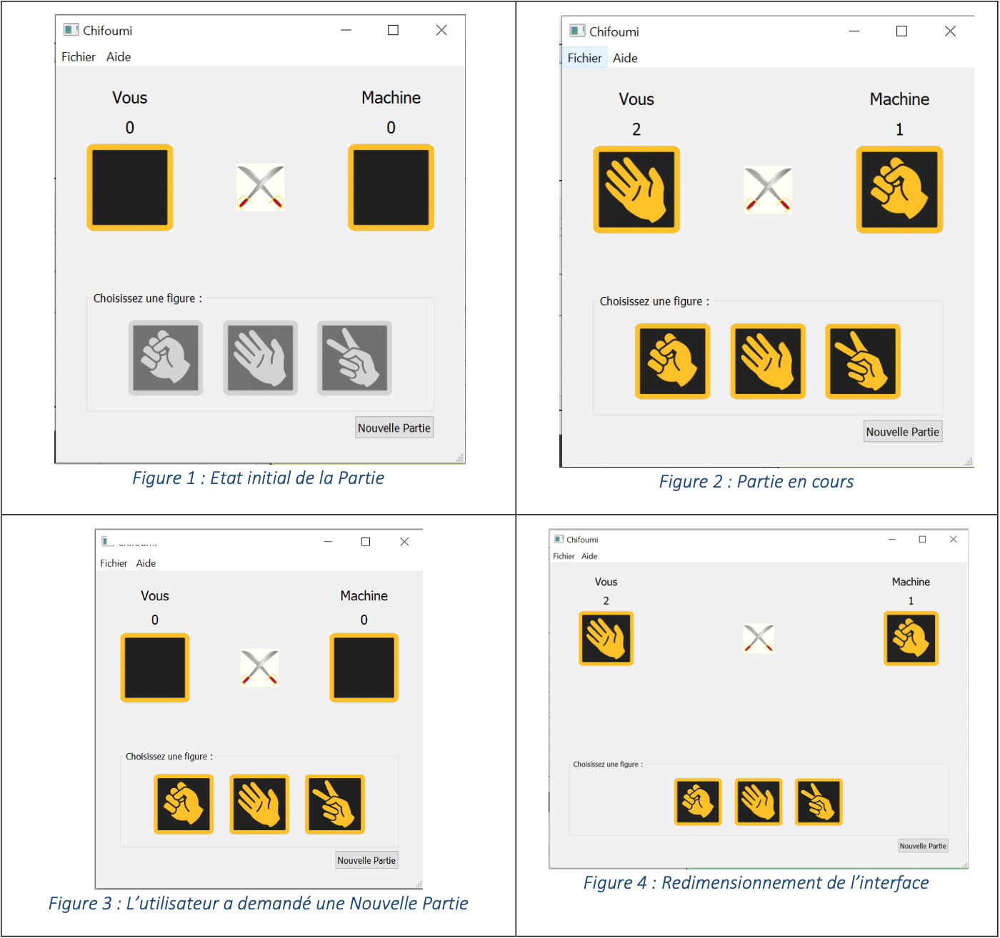

# S2.01 - D'éveloppement d'une application

## Introduction 

<table>
    <thead>
        <tr>
            <th align="center">Version</th>
            <th align="center">Description fonctionnelle</th>
            <th align="center">Références figures</th>
            <th>Avancement</th>
        </tr>
    </thead>
    <tbody>
        <tr>
            <td align="center">v0</td>
            <td align="left">Sources C++ de la classe Chifoumi dans un projet Non Qt</td>
            <td align="center"></td>
            <td align="center"><strong>FAIT</strong></td>
        </tr>
        <tr>
            <td align="center">v1</td>
            <td align="left">Version décrite dans le paragraphe §1 précédent.  La barre de menus est inactive.</td>
            <td align="center"></td>
            <td align="center"><strong>FAIT</strong></td>
        </tr>
        <tr>
            <td align="center">v2</td>
            <td align="left">L’application offre les mêmes fonctionnalités que la version v1. 
            Le code source est structuré selon le modèle MVC. <strong>--></strong> amélioration de l’organisation du code</td>
            <td align="center"></td>
            <td align="center"><strong></strong></td>
        </tr>
        <tr>
            <td align="center">v3</td>
            <td align="left">Le menu <a color="blue">Fichier >> Quitter</a> permet d’arrêter l’application. 
            Le menu <a color="blue">Aide >> A propos de...</a> ouvre une Boîte de Message donnant des informations sur :
             
            - la version de l'application 
            - la date de création 
            - les auteurs 
            </td>
            <td align="center">
            Figure 5, Figure 6, Figure 7</td>
            <td align="center"><strong></strong></td>
        </tr><tr>
            <td align="center">v4</td>
            <td align="left">Le jeu se joue en X points, 5 par défaut. Le premier joueur dont le score a atteint ce maximum a gagné.</td>
            <td align="center">Figure 8, Figure 9</td>
            <td align="center"><strong></strong></td>
        </tr>
        <tr>
            <td align="center">v5</td>
            <td align="left">Le jeu se joue en temps limité, 30 secondes par défaut. A l’issue du temps imparti, il y a un joueur gagnant, ou bien il y a égalité entre les 2 joueurs.</td>
            <td align="center">De Figure 10 à Figure 14</td>
            <td align="center"><strong></strong></td>
        </tr>
        <tr>
            <td align="center">v6</td>
            <td align="left">Le menu <a color="blue">Fichier >> Paramétrer... </a>ouvre une fenêtre de Dialogue dans laquelle l’utilisateur peut modifier différents paramètres avant de commencer la partie : 
            - son nom 
            - le nombre max. de points 
            - le temps max. à jouer 
            Une fois la partie commencée il n'est plus possible de modifier les paramètres.
            </td>
            <td align="center"></td>
            <td align="center"><strong></strong></td>
        </tr>
        <tr>
            <td align="center">v7</td>
            <td align="left">v6+ 
            Le nom du joueur est enregistré dans une base de données.</td>
            <td align="center"></td>
            <td align="center"><strong></strong></td>
        </tr>
        <tr>
            <td align="center">v8</td>
            <td align="left">v7 + 
            A la fin de la partie, le système enregistre dans la base de données le résultat de la partie : 
            Horodatage, nomJoueurHumain, scoreJoueurHumain, joueurMachine, scoreJoueurMachine</td>
            <td align="center"></td>
            <td align="center"><strong></strong></td>
        </tr>
        <tr>
            <td align="center">v9</td>
            <td align="left">Le menu <a color="blue">Fichier >> Réinitialiser...</a> permet de vider la base de données. Une boîte de message indique que l’action s’est bien terminée.</td>
            <td align="center"></td>
            <td align="center"><strong></strong></td>
        </tr>
        <tr>
            <td align="center">v10</td>
            <td align="left">A partir du menu <a color="blue">Fichier >> Résultats...</a>, l’application ouvre une fenêtre de Dialogue dans laquelle elle affiche tous les résultats enregistrés, classés par ordre alphabétique croissant sur le nom du joueur : 
            <strong>nomJoueurHumain1</strong> : 
            - [Horodatage optionnel], scoreJoueurHumain, joueurMachine, scoreJoueurMachine 
            - [Horodatage optionnel], scoreJoueurHumain, joueurMachine, scoreJoueurMachine 
            -... 
            <strong>nomJoueurHumain2</strong> : 
            - [Horodatage optionnel], scoreJoueurHumain, joueurMachine, scoreJoueurMachine 
            - [Horodatage optionnel], scoreJoueurHumain, joueurMachine, scoreJoueurMachine 
            -...</td>
            <td align="center"></td>
            <td align="center"><strong></strong></td>
        </tr>
    </tbody>
</table>

## Version 0 de notre chifoumi 

#### Objectif de cette version 0 :
> Source C++ de la classe Chifoumi dans un projet Non Qt

**Tâche que nous avons éffectué :**
 Création d'un dépôt GitHub permettant le versionning
- Création du projet Non Qt
- Remplissage du Word : Dossier d'analyse de conception
- Complétion de la classe Chifoumi

Nous nous sommes organisés de la façon suivante :
Arthur a produit le dossier d'analyse de conception et a créé le fichier .gitignore.
Mathis a créé le projet Non QT et mit en place le dépôt GitHub.
Colas a rempli le fichier Chifoumi.cpp et a demandé une validation de Mathis et Arthur.

## Version 1 de notre chifoumi 

#### Objectif de cette première version :
> Version décrite dans le paragraphe §1 précédent. La barre de menus est inactive

#### 1.1 Comportement du jeu (aspects fonctionnels et graphiques)
- L’utilisateur joue seul contre la machine.
- Lorsque l’utilisateur lance le programme, le plateau se remplit avec les éléments du jeu et se met en état initial (cf. <a color="blue">[Figure 1](####1.3-copies-d'écran)</a>) : 
    - Partie haute : des zones de visualisation, où l’utilisateur pour consulter les informations qui le concernent (zone intitulée « Vous »), à savoir son score, le dernier coup qu’il a joué, ainsi que les informations concernant la machine, à savoir le score de la machine et le dernier coup qu’elle a joué.
    - Partie basse : des zones d’interaction, où l’utilisateur peut jouer un nouveau coup, ou bien commencer une nouvelle partie.
    - A l’état initial, le bouton « Nouvelle partie » est activé et détient le focus, les boutons contenant les figures (ciseau, papier, pierre) sont inactifs**1**.

- Lorsque la partie en cours (cf. <a color="blue">[Figure 2](####1.3-copies-d'écran)</a>), le déroulement d’une manche est le suivant : 
    - Les boutons-figures sont actifs. Les nom et score du joueur sont de couleur bleue**2** : c’est donc son tour de jouer. Il joue en sélectionnant la figure qu’il souhaite tirer (pierre, papier, ciseau). La figure choisie s’affiche dans la zone d’affichage correspondante. 
    - Les nom et score du joueur machine sont de couleur bleue : c’est donc son tour de jouer. Il choisit aussi une figure. Il s’agit d’un choix aléatoire. La figure est affichée dans la zone adéquate. 
    - Les scores sont mis à jour : + 1 point en fonction du coup de chacun (pierre gagne à ciseau, ciseau gagne à papier, papier gagne à pierre). Les scores restent inchangés en cas de coup identique. Une fois recalculés, les scores de chaque joueur sont affichés dans les zones prévues. 
    - A la fin de la manche, le joueur peut jouer une autre manche (en choisissant une figure), recommencer la partie (les scores sont remis à 0), ou bien arrêter le jeu (fermeture de la fenêtre). Il n’y a pas de gagnant. 

Lorsque la partie est en cours, le bouton « Nouvelle Partie » est toujours actif et est le bouton par défaut**3**.En le cliquant, les scores sont remis et réaffichés à 0, les zones d’affichage des derniers coups joués effacées, les figures sont actives. *(cf. <a color="blue">[Figure 3](####1.3-copies-d'écran)</a>: L’utilisateur a demandé une Nouvelle PartieFigure 3).*

Les Menus Fichier, Aide et le bouton nouvelle partie sont accessibles via des raccourcis clavier. 

#### 1.2 Comportement de l’interface lors du redimensionnement de la fenêtre

Le premier comportement souhaité est le suivant :
- Interface dans l’état initial de l’application : cf. Figure 1
- Lorsque l’utilisateur agrandit la fenêtre alors que la partie n’a pas encore commencé (cf. <a color="blue">[Figure 4](####1.3-copies-d'écran)</a> Erreur ! Source du renvoi introuvable.) :
    - Les éléments composant le bloc ‘Coup-Score’ de chaque joueur restent groupés**4**, les éléments du bloc ‘Boutons’ restent groupés 4, les blocs ‘Coup-Score’ du joueur et de la machine se séparent.
    - Le bouton NvllePartie :
        - Reste proche des autres boutons d’action, mais pas sur la même ligne**5**
        - Est aligné à droite avec les blocs ‘Coup-Score’ de la machine et ‘Boutons’**6**
    - Les espaces libres générés par le grandissement de la fenêtre se rajoutent de manière équitable à gauche et à droite des blocs ‘Coups-Scores’ et ‘Boutons’.

#### 1.3 Copies d'écran

Lorsque ce comportement sera obtenu, il sera modifié / simplifié : la fenêtre restera bloquée sur sa taille initiale (cf. <a color="blue">[Figure 1](####1.3-copies-d'écran)</a> et <a color="blue">[Figure 2](####1.3-copies-d'écran)</a>).
